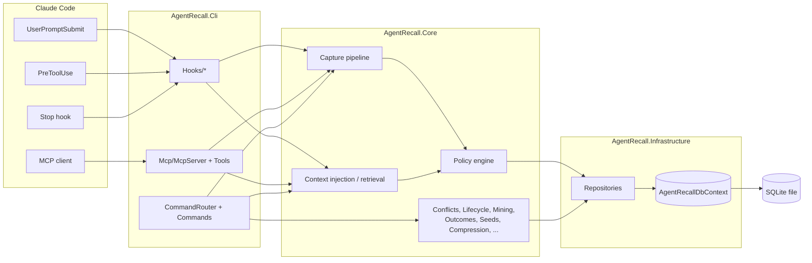
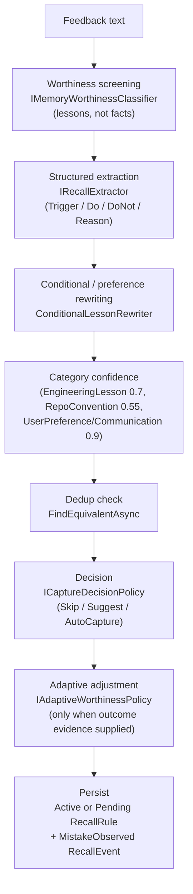
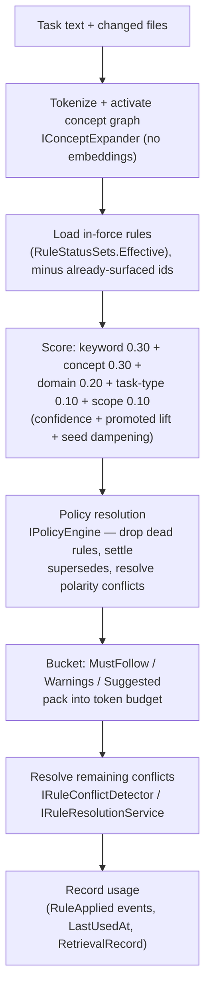

# AgentRecall Architecture

A local-first memory for AI coding agents. AgentRecall captures the feedback and
failures you run into while coding, turns them into reusable technical rules, and
serves those rules back — on the command line or directly to Claude Code over MCP.
Everything runs locally against a single SQLite file: no cloud sync, no web UI, no
API keys. "Semantic" ranking is a deterministic built-in concept graph, not vector
embeddings — embeddings are an optional extension point (`IEmbeddingProvider`) that
contributes nothing by default.

## Solution layout

```
AgentRecall.slnx
├─ src/AgentRecall.Core            domain model + all business logic (no I/O)
├─ src/AgentRecall.Infrastructure   EF Core / SQLite persistence + DI wiring
├─ src/AgentRecall.Cli              CLI entrypoint, MCP server, Claude Code hooks
└─ tests/AgentRecall.Tests          one flat test project, integration-style
```

Standard layered dependency direction: `Cli → Infrastructure → Core`, and
`Cli → Core` directly for the domain interfaces it calls through DI. `Core` has no
dependency on `Infrastructure` or `Cli` — it only defines abstractions
(`src/AgentRecall.Core/Abstractions/Repositories.cs`) that `Infrastructure`
implements.

- **Target frameworks**: `Core`/`Infrastructure`/`Cli` multi-target
  `net8.0;net10.0`; `AgentRecall.Tests` targets `net10.0` only.
- **Database**: SQLite via EF Core (`Microsoft.EntityFrameworkCore.Sqlite`), no EF
  migrations — schema is created with `EnsureCreatedAsync` and additively
  reconciled on upgrade (see [Persistence](#persistence)).
- **Version**: single source of truth is `VersionPrefix` in `Directory.Build.props`.

## High-level architecture



## Core domain model

`src/AgentRecall.Core/Domain/*.cs`

| Entity | Purpose |
|---|---|
| `RecallRule` | The central entity: a learned rule — `Trigger`/`Mistake`/`RuleText`, `Category`, `Status`, `Confidence`, `ScopeLevel`/`ScopeValue`, `Source` (`Learned` vs `BuiltInSeed`), `AlwaysApply`, supersede links, capture provenance. |
| `RecallEvent` | Append-only ledger row (rule created/updated/applied/superseded/mistake observed/etc.) — the audit trail behind everything. |
| `RecallScope` | A named scope (level + value + description) lookup. |
| `RetrievalRecord` | Records that a set of rule ids was injected for a task, so later outcomes can attach to that specific retrieval. |
| `RuleOutcome` | One observed real-world outcome for a rule, with the confidence delta it produced. |
| `LessonCandidate` | A mined-but-unreviewed proposed rule, clustered by a normalized key. |
| `RuleLifecycleRecommendation` | An advisory action (Promote/Archive/Supersede/Review/Raise-or-Lower-Confidence) on a rule — never applied automatically. |
| `TurnFinalization` | One record of a completed-turn capture decision, keyed by a content hash for idempotency. |
| `AgentRecallActivity` | The human-visible activity ledger (distinct from what's injected into model context), correlated across hooks by `TurnId`. |
| `CareerImpactCandidate` | Output of the opt-in career-impact detector: significance/confidence score + structured coaching detail. |

`RuleStatusSets` is the single source of truth for which statuses are "in force"
(`Active`, `Promoted`) vs "dead" (`Superseded`, `Retired`, `Archived`) — the policy
engine, context injection, and search all read from it rather than re-deriving it.

## Capture pipeline

How feedback or an observed mistake becomes a stored `RecallRule`. Two entrypoints
converge on `IFeedbackService`.

**A. Manual/explicit path** — `agentrecall feedback add`, MCP `add_feedback` /
`capture_feedback`, PR-comment import, log import — via
`FeedbackService.AddAsync` (`src/AgentRecall.Core/Services/FeedbackService.cs`):



**B. Turn-based / semantic-judge path** — the Stop hook and `finalize-turn`
command, via `ITurnFinalizer` (`src/AgentRecall.Core/Finalization/TurnFinalizer.cs`):

1. Idempotency check via a SHA-256 hash of `(Cwd, Source, Prompt, AssistantResponse)`.
2. Builds a bounded `CaptureJudgeInput` (prompt, assistant summary, acceptance
   signal, up to 12 relevant existing rules from `IPolicyEngine`).
3. `ICaptureJudge.JudgeAsync` — **the model itself decides** whether the turn is
   memory-worthy; a `null` verdict means "judge unavailable" and the turn is
   skipped. There is no keyword fallback. `HostSuppliedCaptureJudge` makes no
   model/network call of its own — it just returns whatever verdict was supplied
   on the input. The native Stop hook invocation carries no `judgment` field (it's
   not part of Claude Code's own payload shape), so the model must proactively
   construct one and pipe it into `finalize-turn` itself before the native hook
   fires; `agentrecall devcontainer init`'s scaffolded `CLAUDE.md` instructs it to
   do this on every substantive turn. `TurnFinalizer.GetLastAsync` and
   `TurnSummaryService.FindFinalizationByTurnAsync` prefer a real judged decision
   over a same-turn "unavailable" record, so the native hook firing afterward with
   nothing to add never buries the model's self-reported verdict.
4. The verdict is validated and mapped to a `CaptureJudgeOutcome`
   (AutoCapture/Suggest/Supersede/Reinforce/Skip).
5. Persisted via `IFeedbackService.AddJudgedAsync` (bypasses the worthiness/decision
   policy — the judge already decided) or `IRuleLifecycleService` for
   Supersede/Reinforce. A repeated correction promotes the rule to `AlwaysApply`.
6. Recorded as a `TurnFinalization` row.

## Retrieval / context-injection pipeline

Entry: `IContextInjectionService.BuildContextAsync`
(`src/AgentRecall.Core/Context/ContextInjectionService.cs`), called from
`agentrecall inject-context`, both `UserPromptSubmit`/`PreToolUse` hooks, and MCP
`get_relevant_context` / `inject_context`.



`TurnSummaryService` later joins the hook-time `ContextFetched` activity with the
Stop-hook's capture activity (via `TurnId`) into one end-of-turn "Turn Memory
Summary". `LearningReportService` is a separate, on-demand aggregation of the full
corpus + event ledger for analytics — not part of live retrieval.

## Persistence

- `AgentRecallDbContext` (`src/AgentRecall.Infrastructure/Persistence/`) —
  `DbSet<>`s for rules, events, scopes, retrievals, outcomes, lesson candidates,
  recommendations, turn finalizations, activities, career-impact candidates. Enums
  are stored as strings for additive schema evolution.
- `DatabaseInitializer` creates the data directory, runs `EnsureCreatedAsync`
  (no EF migrations), enables WAL journaling, then `SchemaReconciler` additively
  backfills columns/indexes for databases created by older versions.
- A 30-second busy timeout (connection string + EF command timeout) lets the MCP
  server and short-lived per-hook CLI processes serialize writes against the one
  SQLite file instead of failing on `SQLITE_BUSY`.
- Repository interfaces live in `AgentRecall.Core/Abstractions` (`IRecallRuleRepository`,
  `IRecallEventRepository`, `IRuleOutcomeRepository`, `ILessonCandidateRepository`,
  `IRuleLifecycleRecommendationRepository`, `ITurnFinalizationRepository`,
  `ICareerImpactCandidateRepository`, `IAgentRecallActivityRepository`, ...); each
  has a matching EF implementation in `AgentRecall.Infrastructure/Persistence/Repositories`.

## CLI, MCP, and hooks (`src/AgentRecall.Cli`)

- **`Program.cs`** — entrypoint. Runs a self-healing PATH check
  (`Setup/PathSetup.cs`, skipped for `mcp`/`hook`/`setup`/`finalize-turn`/
  `capture-status` to keep a clean stdio contract), builds the DI container via
  `AppHost.Build()`, and delegates to `CommandRouter.RunAsync`.
- **`CommandRouter`** (partial class across `Commands/*.cs`) — dispatches ~25 top-level
  commands: `feedback`, `rules`, `search`, `inject-context`, `import`, `eval`,
  `report`, `dna`, `outcome`, `lessons`, `lifecycle`, `hook`, `finalize-turn`,
  `capture-status`, `turn-summary`, `activity`, `seed`, `career`, `cleanup`, `mcp`,
  `devcontainer`, `setup`, `status`, `init`, `help`.
- **MCP server** (`Mcp/McpServer.cs`) — a minimal JSON-RPC 2.0-over-stdio server
  started via `agentrecall mcp`. Tools live one-per-file in `Mcp/Tools/`:
  `search_rules`, `get_rule`, `add_feedback`, `get_project_rules`,
  `get_relevant_context`, `suggest_feedback_candidate`, `capture_feedback`,
  `get_reminders`, `capture_status`, `resolve_rules`, `compress_memory`,
  `inject_context`, `import_pr_comments`. Tool failures are returned as
  `isError:true` content — never let an exception corrupt the JSON-RPC stream.
- **Claude Code hooks** (`Hooks/*.cs`), dispatched by `CommandRouter.HookAsync`:
  - `user-prompt-submit` → builds context for the whole turn, scoped to the
    repository; gated by a deterministic dev-relevance keyword filter.
  - `pre-tool-use` → fires before `Edit`/`Write`/`MultiEdit`, keyed on the specific
    file/snippet about to be written (catches conventions a high-level prompt like
    "implement login" wouldn't surface); excludes rules already shown this turn.
  - `Stop` hook → wired by the devcontainer scaffolder to `finalize-turn --hook`,
    i.e. the judge-based `ITurnFinalizer` path described above (§Capture pipeline,
    path B) — this is the canonical, currently-wired capture path. The older
    keyword-heuristic `capture` command (`Hooks/CaptureHook.cs`,
    `IFeedbackCandidateAnalyzer` + `ITurnCandidateExtractor`) still exists as a
    separate command but is not what the scaffolder wires to `Stop`.
  - All hook handlers are defensive: they never throw to the caller — failures go
    to stderr and the hook returns empty so Claude Code is never blocked.
- **`Devcontainer/DevcontainerScaffolder.cs`** — `agentrecall devcontainer init`
  wires the three hooks into `.claude/settings.json` idempotently, ensures a
  standing AgentRecall guidance block in `CLAUDE.md`, and optionally scaffolds
  `.devcontainer/devcontainer.json` with a post-create script that reinstalls
  AgentRecall on every rebuild.

## Supporting modules (`src/AgentRecall.Core`)

One line each — all deterministic, no LLM calls except where noted:

- **Conflicts** — detects when two rules push the same subject in opposing
  directions (negation, curated antonym pairs, action-vs-anti-pattern) and picks a
  winner with an explanation.
- **Policy** (`PolicyEngine`) — drops dead-status rules, settles explicit
  supersedes, resolves conflicts by fixed precedence (project-specificity >
  explicit supersede > learned-over-seed > priority > recency > confidence > id).
- **Dna** (`ProjectDnaService`) — aggregates rules/events/outcomes into a
  structured onboarding report.
- **Evaluation** (`RetrievalEvaluator`) — Precision@1/@3 and Recall@5 for retrieval
  against a labeled dataset (`agentrecall eval`).
- **Lifecycle** (`RuleLifecycleRecommendationService`) — proposes one advisory
  action per rule from retrieval/outcome/staleness/conflict metrics; never
  mutates a rule without `--apply`.
- **Mining** (`LessonMiningService`) — clusters repeated mistake/rejection events
  into `LessonCandidate`s once a pattern repeats enough; human review required.
- **Outcomes** (`OutcomeTrackingService`) — records real-world outcomes against
  rules/retrievals and adjusts confidence by a clamped delta.
- **Preferences** (`UserPreferenceRecognizer`) — recognizes explicitly stated
  communication/interaction preferences (verbosity, prompt format, questioning
  frequency, honesty, ...) so they're captured with high trust; deliberately does
  **not** decide response language — that's the model's call, not this recognizer's.
- **Seeds** (`SeedPackService`) — installs curated starter rule packs (e.g.
  "tidy-first") idempotently as `BuiltInSeed`-sourced rules at reduced initial
  confidence, reinforced passively on repeated uneventful use.
- **CareerImpact** — opt-in, gated behind an installed seed pack, flags
  promotion-worthy work at end-of-turn with structured coaching detail.
- **Compression** (`MemoryCompressionService`) — groups near-duplicate rules,
  synthesizes one canonical replacement, and supersedes (never deletes) the
  originals.
- **Memory** (`MemoryWorthinessClassifier`) — the "lessons, not facts" gate;
  `AdaptiveWorthinessPolicy` (in `Capture/`) layers outcome-aware evidence on top,
  so worthiness depends on what produced a candidate, not just its wording.

## Dependency injection

`AgentRecall.Infrastructure/DependencyInjection/ServiceCollectionExtensions
.AddAgentRecallPersistence` is the single composition point: EF Core `DbContext` →
repositories (scoped) → deterministic capture/extraction services (mostly
singleton) → retrieval (`IRecallSearchService`, `IContextInjectionService`) →
policy → conflicts → lifecycle/outcomes/mining/reporting → activity/summary → dna
→ seeds → career impact. `AppHost.Build()` layers `AgentRecallOptions`, logging, and
`IMemoryService` on top for the CLI process itself.

## Testing

`tests/AgentRecall.Tests` is one flat project organized around functional slices
(hooks, capture, policy, persistence, MCP, CLI surface) rather than mirroring
`src/` 1:1. `TestDatabase.cs` is the shared harness: a real `ServiceProvider` wired
with the same production `AddAgentRecallPersistence()` call, backed by a throwaway
SQLite file in a unique temp directory — most tests are integration-style against
real EF Core + SQLite, not mocks. A `configureServices` callback lets an individual
test swap in a fake (e.g. `FakeCaptureJudge`) via last-registration-wins.
